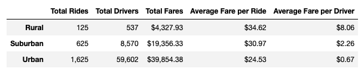
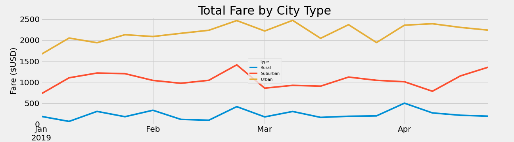

# PyBer_Analysis

Source Code: [PyBer_Analysis](https://github.com/crdhilep/PyBer_Analysis/blob/main/PyBer_Challenge.ipynb)

## Overview of Analysis:

The purpose of this project is to perform exploratory analysis of Pyber ride sharing data in order to gain an understanding of ridership and fare metrics by the types of cities in which Pyber operates.
Create visualizations of rideshare data for PyBer to help improve access to ride-sharing services and determine affordability for underserved neighborhoods.

## Results:

From the summary data frame, we can see that there is a relationship between how populated a city is and the total number of rides, which directly affects the total number of drivers and total fare.

### Analysis 1:

Although the total number of rides, drivers and fares decrease as the cities become farther from urbanized areas, the average fare per ride and per driver seems to increase. This can be explained by the accessibility of PyBer rides and drivers in rural areas. Less drivers in rural areas will may lead to a higher average fare per ride and driver, as prices increase when supply is low. 

### Analysis 2:

With the multiple-line chart, we are able to compare total fares by city type over a period of five months. 
The number of rides seem peak at the end of February and fluctuates during the month of March. All the graphs tend to follow the same trend throughout these months, except for the trend in suburban cities, where we see a sharper increase during the month of April. 

## Summary:

- Urban cities have the highest ridership demand while rural cities have the least.
- Urban cities have 4x+ more drivers than suburban cities.
- Suburban cities have 6x + drivers than rural with almost 4.5x the revenue.
- Rural cities have the highest average fare per ride and driver. 
- The summary data shows a relationship in which fare revenue is higher by city type when there is a larger ratio of drivers to rides. 

## Recommendations:

1) Increasing the amount of drivers in Rural areas to ensure there are enough drivers to meet ride demand. 

2) Data for rural cities shows that the average fare per ride and average fare per driver is much higher than Suburban and urban cities.This can indicate that rural area based riders are taking trips over a longer distance. This can result in a majority of drivers being occupied with current trips and loss in potential revenue when there are peaks in business.
